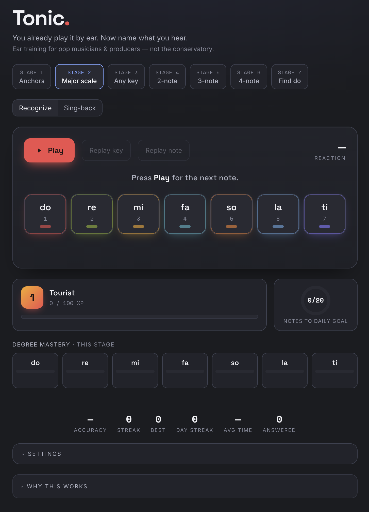

# Tonic.

[](https://github.com/pasuay/tonic/actions/workflows/ci.yml)

**You already play it by ear. Now name what you hear.**
Ear training for pop musicians & producers — not the conservatory.

### ▶ [Use it now — pasuay.github.io/tonic](https://pasuay.github.io/tonic/)

Free, no signup. Runs in the browser; progress saves locally on your device.
Use headphones; allow the mic for Sing-back mode.



## What it does

You can already replay melodies and chords by ear — what's missing is the ability to instantly **name** what you hear. Tonic trains that link: a short chord progression establishes the key, a note (or phrase) plays, and you name its scale degree in movable-do solfège. That's *functional* ear training — hearing each note by its role in the key, the way pop musicians actually use their ears.

- **7 stages**, simplest first: three anchor tones → the full major scale → random keys → 2/3/4-note phrases → *Find do*, where no key is given and you infer the tonic yourself
- **Sing-back mode**: the app names a degree, you sing it — a live needle checks your pitch (any octave)
- **Pop-shaped**: I–V–vi–IV and friends, minor keys (la-based), five instrument sounds
- **Adaptive**: weak degrees appear more often; recurring confusions trigger short pair drills
- **Fair by construction**: every *Find do* melody passes a Krumhansl–Schmuckler key-clarity gate before it's served
- Daily goal, streaks, XP — enough game to keep you honest, not enough to distract

## Why this works

**You name notes by their role, not their letter.** Every round starts by establishing a key (a short cadence — I–IV–V–I, or pop progressions like I–V–vi–IV), and you identify the note that follows by its *function* in that key: do, re, mi… This is functional ear training in movable-do solfège. It matches how tonal music is actually perceived: a note's identity comes from its relationship to the tonal centre, and experiments show that a tonal context measurably sharpens pitch perception compared to hearing notes in isolation.¹ It's also how pop musicians use their ears in practice — you don't need to know a song is in E♭ to hear that the hook lands on the 5th.

**Unstable tones resolve; your inner ear learns the pull.** After each answer, the note can walk home to the tonic (ti→do, fa→mi→re→do). Hearing — and in Sing-back mode, *producing* — these resolutions is the core of the Kodály tradition of ear training: singing before naming, tonic-anchored, staged from a handful of tones to the full scale.² Tonic's stages follow that simplest-first ramp: three anchor tones → the full major scale → randomised keys → short phrases → melodies with no key given at all.

**Find do trains the skill nobody hands you in real life: locating the tonal centre yourself.** Listeners internalise a *tonal hierarchy* — which tones are stable in a key — and can infer a tonic from just a few notes of context; this is one of the most replicated findings in music cognition.³ In the Find do stage, a short melody plays cold and you must find do before you can name anything. Every melody is vetted by the Krumhansl–Schmuckler key-finding model before it's served: the intended key must beat all 23 rival keys by a clear margin,⁴ so the exercise is never a guessing game against an ambiguous melody.

**Practice is retrieval, feedback is immediate, and the app pushes where you're weak.** Each round is a recall test with instant correction — missed phrases replay with the correct answer lighting up. Degrees you miss appear more often; recurring confusions (fa↔la is a classic) trigger short focused pair drills. The daily goal exists because distributed daily practice beats occasional marathons — the spacing effect is among the most robust results in learning research.

**Honest limits.** The pad colors are a *scaffold* that fades as stages advance — they encode each degree's tension, they don't claim to give you synesthesia or absolute pitch. And no app replaces singing with real musicians or a good teacher; Tonic trains one specific, high-leverage link: hearing a note and knowing its name.

### References
1. Tonal context improves pitch discrimination — Marmel, Tillmann & Dowling, [*Tonal expectations influence pitch perception*](https://pmc.ncbi.nlm.nih.gov/articles/PMC5640898/), Frontiers in Psychology.
2. The Kodály approach: singing-first, movable-do, staged simplest-first — [Organization of American Kodály Educators, *The Kodály Concept*](https://www.oake.org/the-kodaly-concept/).
3. Tonal hierarchy & probe-tone paradigm — Krumhansl & Kessler; overview and modern replication in [*Probe-Tone Paradigm Reveals Less-Differentiated Tonal Hierarchy in Rock Music*](https://online.ucpress.edu/mp/article/38/5/425/117147/), Music Perception.
4. Key inference from short contexts — [*Perceptual Tests of an Algorithm for Musical Key-Finding*](https://www.researchgate.net/publication/7503748_Perceptual_Tests_of_an_Algorithm_for_Musical_Key-Finding), JEP:HPP.

Summaries are paraphrased; follow the links for the primary sources.

## Development

```
npx serve .          # run locally (ES modules need http)
npm ci && npm run test:all   # 64 logic + 35 interaction tests
```

Vanilla ES modules, no build step: pure music theory (`js/theory.js`), audio engine, round state machine, stats, and DOM rendering are separate modules; tests gate every deploy.
